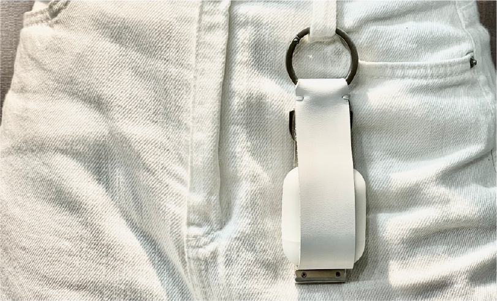

    

        
        
        
        
        
        
        

            <iframe src="https://www.youtube.com/embed/yzrm9XEBiRk" title="YouTube video player" frameborder="0" allow="accelerometer; autoplay; clipboard-write; encrypted-media; gyroscope; picture-in-picture" allowfullscreen></iframe>
        

    

